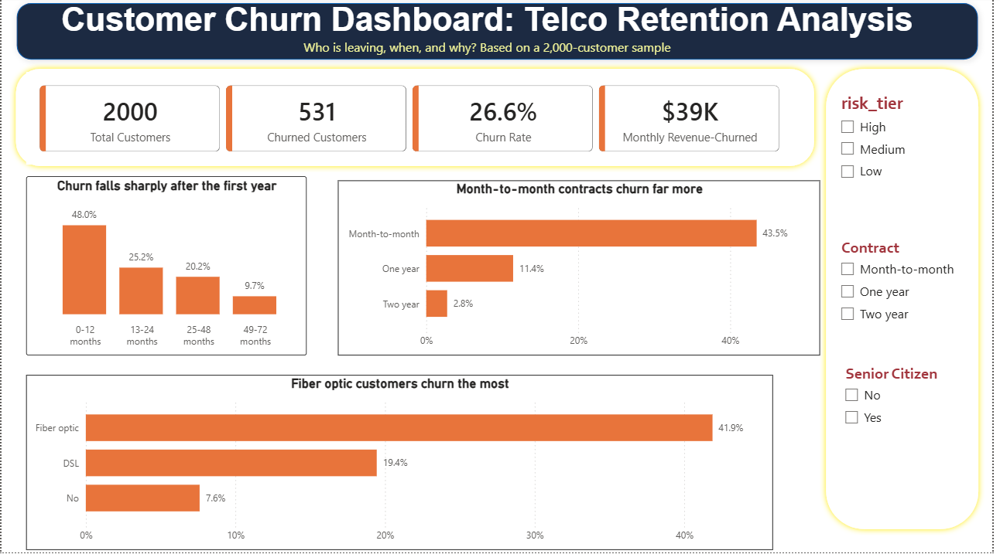
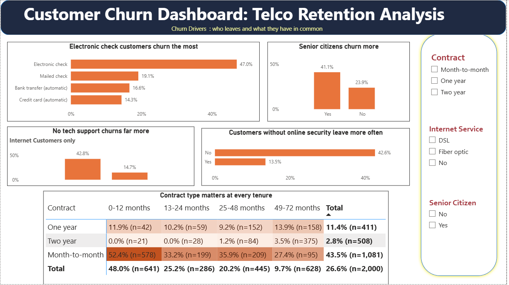
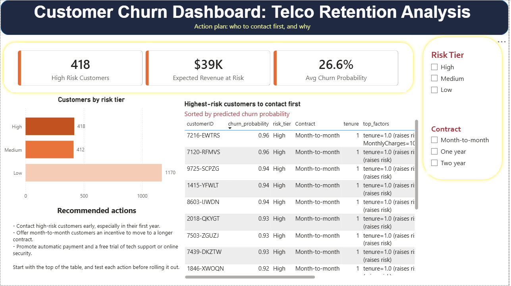

# Customer Churn Analysis

## 1. Overview

This project analyzes customer churn for a telecom company to understand which customers leave, when they leave, what they have in common, and who the retention team should contact first.

The project follows an end-to-end data analytics workflow, starting with data exploration and cleaning in Python, followed by exploratory analysis, a churn prediction model with explanations, and an interactive three-page dashboard in Power BI that ends in a ranked list of at-risk customers.

> **Built with AI assistance.** Claude Code and Claude (chat) were used to draft code and guide the work. All decisions, reviews and result checks were mine. See [Section 11](#11-how-this-project-was-built) for details.

**Project Objectives:**

* Measure how much churn exists and where it is concentrated.
* Identify customer segments with the highest churn.
* Predict which customers are likely to churn, and explain why.
* Turn the findings into recommended retention actions.

## 2. Dataset

The project uses the **Telco Customer Churn** dataset, an IBM sample dataset published on Kaggle: [kaggle.com/blastchar/telco-customer-churn](https://www.kaggle.com/blastchar/telco-customer-churn).
The data files are © Original Authors, so this repository does not redistribute them

* **Original size:** 7,043 customers and 21 columns.
* **Analysis sample:** a stratified random sample of **2,000 customers** (stratified on churn, `random_state=42`) with **12 columns**. Churn is 26.55% in the sample versus 26.54% in the full file.
* **The raw data is not included** in this repository. See [How to Run](#7-how-to-run) to download it.

**Key data attributes (12 columns kept):**

* `customerID`: unique customer identifier
* `SeniorCitizen`: whether the customer is a senior citizen (0/1)
* `Dependents`: whether the customer has dependents
* `tenure`: number of months as a customer
* `InternetService`: DSL, Fiber optic, or No
* `OnlineSecurity` and `TechSupport`: whether the customer has these services
* `Contract`: Month-to-month, One year, or Two year
* `PaymentMethod`: how the customer pays
* `MonthlyCharges` and `TotalCharges`: billing amounts
* `Churn`: whether the customer left (Yes/No)

**Analysis columns added:** `churn_flag`, `senior_label`, `tenure_group`, `monthly_charges_band`, `has_internet` and `auto_pay`.

*Note: this is a sample dataset for learning, not a real company's records.*

## 3. Tools & Technologies

| Tool                          | Purpose                                                    |
| ----------------------------- | ---------------------------------------------------------- |
| Python                        | Data exploration, cleaning, analysis, and modelling        |
| Pandas & NumPy                | Data manipulation and preprocessing                        |
| Matplotlib & Seaborn          | Data visualization                                         |
| Scikit-learn & XGBoost        | Churn prediction models and evaluation                     |
| SHAP                          | Explaining model predictions                               |
| Jupyter Notebook (VS Code)    | Analysis and modelling environment                         |
| Power BI (DAX)                | Interactive dashboard development                          |
| Git & GitHub                  | Version control and project hosting                        |
| Claude Code & Claude          | AI assistance for code drafting and guidance               |

## 4. Project Workflow

### Step 1: Data Loading & Exploration

* Loaded the raw dataset into Python using Pandas (`src/explore_data.py`).
* Examined the structure, dimensions, and data types.
* Checked missing values, duplicates, and blank text values.
* Found that `TotalCharges` is stored as text because 11 rows contain a blank space, which a normal missing-value check does not detect.

### Step 2: Data Cleaning & Preprocessing

* Set the 11 blank `TotalCharges` values to 0.0. All 11 are brand-new customers with tenure 0. The script stops with an error if any other value fails to convert.
* Kept `SeniorCitizen` as 0/1 and kept "No internet service" as its own category.
* Took a stratified 2,000-row sample and kept 12 columns (`src/clean_data.py`).
* Added safety checks: exact row and column counts, no missing values, unique customer IDs, and a   SHA-256 hash proving the raw file was not modified.


### Step 3: Feature Engineering

* Created six analysis columns (`src/features.py`): `churn_flag`, `senior_label`, `tenure_group` (0-12, 13-24, 25-48, 49-72 months), `monthly_charges_band` (up to $35, $35-$70, $70-$90, over $90), `has_internet` and `auto_pay`.
* Checked that each group was large enough to give reliable churn rates.

### Step 4: Exploratory Data Analysis

* Answered nine questions with Pandas `groupby` and charts (`notebooks/01_eda.ipynb`): churn by tenure, contract, internet service, payment method, support services, and senior status.
* Built a contract-by-tenure heatmap to check whether contract type matters after accounting for tenure, and flagged cells with fewer than 30 customers.
* Compared monthly charges of churned and retained customers, and identified a confounder (customers with no internet).

### Step 5: Churn Prediction Model

* Predicted churn from 10 customer columns (one-hot encoded) with a stratified 80/20 split and 5-fold cross-validation (`notebooks/02_model.ipynb`).
* Compared a "never churns" baseline, logistic regression, and XGBoost. The baseline is right about 73.5% of the time yet catches no churners, so accuracy alone is misleading and the evaluation uses ROC-AUC, precision, and recall.

| Model                     | Test ROC-AUC | 5-fold CV ROC-AUC | Precision / Recall at threshold 0.3 |
| ------------------------- | ------------ | ----------------- | ----------------------------------- |
| Baseline (always "stays") | 0.50         | n/a               | n/a                                 |
| Logistic regression       | 0.85         | (+/-0.016)        |0.64 / 0.51                          |
| XGBoost                   | 0.84         | (+/-0.018)       | 0.64/ 0.47                          |

* Used SHAP to explain which inputs push risk up or down. 
* Scored every customer with out-of-fold predictions (each customer is scored by a model that never saw them), grouped into risk tiers: **High** above 50%, **Medium** 25-50%, **Low** 25% or below.
* Generated up to three plain-English reasons per customer from SHAP values, saved in `data/processed/customers_scored.csv`.

### Step 6: Power BI Dashboard

* Loaded the cleaned and scored data and joined the two tables on `customerID` (one-to-one).
* Created DAX measures for churn rate, high-risk customers, and expected revenue at risk.
* Built three pages with KPI cards, charts, slicers, a heatmap matrix, and a ranked at-risk customer table.
* Checked the Power BI figures against the Pandas results.

Main measures:

```
Total Customers = COUNTROWS(customers)
Churned Customers = SUM(customers[churn_flag])
Churn Rate = DIVIDE([Churned Customers], [Total Customers])
High Risk Customers = CALCULATE(COUNTROWS(scores), scores[risk_tier] = "High")
Expected Revenue at Risk = SUMX(customers, customers[MonthlyCharges] * RELATED(scores[churn_probability]))
```

### 7. LLM API Integration

Built a full pipeline for calling an LLM from Python: generating a realistic
customer comment from a customer's real account details, then classifying
that comment into **validated, structured JSON** (sentiment, topic, urgency),
with automatic retries on invalid output, temporary server errors, and daily
rate limits.

**Tested live against Google's Gemini API** (free tier) on 10 real customers
from the dataset (5 churned, 5 retained). Sample result:

| customerID | Churn | Sentiment | Topic | Urgency |
|---|---|---|---|---|
| 6323-AYBRX | Yes | negative | price | 5 |
| 2636-OHFMN | Yes | negative | price | 5 |
| 1025-FALIX | No | positive | network_quality | 1 |
| 9137-NOQKA | No | positive | price | 1 |

Full results: [`outputs/sample_customer_comments.csv`](outputs/sample_customer_comments.csv)

**Important limitation:** the comment-generation prompt was given the
customer's actual churn outcome as an input, so generated comments naturally
matched that outcome, and the classification step then correctly detected the
sentiment it was given. This confirms the pipeline works end-to-end
(prompting, JSON validation, retries, rate-limit handling), but it does **not**
demonstrate that sentiment analysis predicts real churn — the "opinions" were
synthetic and already consistent with the known label. Real customer text
would be needed to test that claim properly.

**Engineering notes:** the free-tier API enforces a hard daily request quota
per model. The final script handles this by checking already-processed
customers before each run (so repeated runs make incremental progress rather
than repeating work), retrying with exponential backoff on temporary server
errors, and safely appending new results rather than overwriting the output
file on a partial or failed run.

## 5. Dashboard

The Power BI dashboard has three pages that move from an overview to drivers to an action plan.

**Page 1: Overview.** How big is the churn problem, and where is it concentrated?



**Page 2: Churn Drivers.** Who leaves, and what do they have in common?



**Page 3: Action Plan.** Which customers are at highest risk, and why?



**Key dashboard components:**

* KPI cards: total customers, churned customers, churn rate, and monthly revenue lost
* Churn rate by tenure, contract, internet service, payment method, and senior status
* Tech support and online security comparison (internet customers only)
* Contract-by-tenure heatmap with customer counts
* High-risk customer count, expected monthly revenue at risk, and a ranked at-risk customer table with reasons
* Slicers for contract, internet service, senior status, and risk tier

A PDF of the full report is available in [`dashboard/churn_dashboard.pdf`](dashboard/churn_dashboard.pdf).

## 6. Results & Business Insights

All figures come from the 2,000-customer sample (overall churn: **26.6%**, 531 customers). They are **associations, not proven causes.**

| # | Finding                                              | Numbers                                                                                                     |
| - | ---------------------------------------------------- | ----------------------------------------------------------------------------------------------------------- |
| 1 | The first year is the risk period                    | Churn is 48.0% in months 0-12, and 9.7% after 4+ years                                                      |
| 2 | Contract type is the strongest single pattern        | Month-to-month churn is 43.5%, versus 2.8% on two-year contracts                                            |
| 3 | The contract effect is not just a tenure effect      | At 49-72 months, month-to-month churn is 27.4% versus 3.5% for two-year                                     |
| 4 | Payment method and internet type stand out           | Electronic check 47.0% versus 14.3% for automatic credit card; fiber optic 41.9%, about 2.2 times DSL       |
| 5 | Support and security services go with lower churn    | About 43% without tech support or online security, versus about 13-15% with them (internet customers only)  |
| 6 | Senior citizens churn more                           | 41.1% versus 23.9%                                                                                          |
| 7 | Price alone is misleading                            | The gap between churned and retained customers shrinks once customers with no internet are set aside        |

The model flags **418 customers as High risk**, with an expected monthly revenue at risk of about **$39K**.

### Recommendations

| Action                                                           | Evidence                          | How to test it                                              |
| ---------------------------------------------------------------- | --------------------------------- | ----------------------------------------------------------- |
| Contact high-risk customers early, especially in the first year  | 48.0% first-year churn            | Compare churn of contacted and not-contacted new customers  |
| Offer month-to-month customers an incentive for a longer contract | 43.5% vs 2.8% churn               | Track who switches, and their churn afterwards              |
| Encourage automatic payment                                      | 47.0% vs 14.3% churn              | Track churn after customers change payment method           |
| Trial tech support and online security                           | About 43% vs 13-15% churn         | Compare trial takers with a similar group                   |
| Work the ranked risk list from the top                           | 418 High-risk customers           | Track contacts made and customers retained per week         |

### Limitations

* The data is a public IBM sample dataset, not a real company's records.
* The analysis uses a 2,000-row sample from a single point in time, so it cannot show trends.
* Contract type, payment method, and internet type overlap, and only contract and tenure were separated.
* The model has no data on outages, competitor offers, or complaints, which often drive churn.
* Some heatmap cells have fewer than 30 customers and are unreliable.

## 7. How to Run

### Prerequisites

Install or set up the following tools:

* Python 3.x
* Jupyter Notebook (or VS Code with the Jupyter extension)
* Power BI Desktop (Windows)

### Setup Instructions

**1. Clone the repository**

```bash
git clone <your-repository-url>
cd AI-assisted-customer-churn-analysis
```

**2. Create a virtual environment and install the libraries**

```bash
python -m venv venv
venv\Scripts\activate
pip install -r requirements.txt
```

**3. Download the dataset**

* Download **Telco Customer Churn** from Kaggle: [kaggle.com/blastchar/telco-customer-churn](https://www.kaggle.com/blastchar/telco-customer-churn).
* Save it as `data/raw/Telco-Customer-Churn.csv`.

**4. Run the data pipeline**

```bash
python src/clean_data.py
python src/features.py
```

**5. Run the notebooks**

* Open `notebooks/01_eda.ipynb` and run all cells for the analysis.
* Open `notebooks/02_model.ipynb` and run all cells for the model and risk scores.

**6. Open the Power BI dashboard**

   **6. View or rebuild the Power BI dashboard**

   * The final dashboard is shown in the screenshots and PDF in `dashboard/`.
   * The `.pbix` file is not included, because it embeds the source data. To rebuild it, load `data/processed/customers_features.csv` and `customers_scored.csv` into Power BI, join them on `customerID` (one-to-one), and add the measures listed in Step 6 of the workflow.

*The `.env` file is only needed for the optional LLM scripts and must never be committed to GitHub.*

## 8. Project Structure

```text
ai-assisted-customer-churn-analysis
│
├── data/
│   ├── raw/                     (not included,see section 7)
│   └── processed/
│       ├── telco_churn_clean_2000.csv
│       ├── customers_features.csv
│       └── customers_scored.csv
│
├── notebooks/
│   ├── 01_eda.ipynb
│   └── 02_model.ipynb
│
├── src/
│   ├── explore_data.py
│   ├── clean_data.py
│   ├── features.py
│   ├── mychecks.py
│   ├── llm_hello_gemini.py
│   └── llm_json_test_gemini.py
│
├── dashboard/
│   ├── churn_dashboard.pbix
│   ├── churn_dashboard.pdf
│   └── screenshots/
│       ├── overview.png
│       ├── churn_drivers.png
│       └── action_plan.png
│
├── outputs/  
|── sample_customer_comments.csv                   (cleaning report,summary tables)
├── CLAUDE.md
├── requirements.txt
└── README.md

```
   The 'data/raw/' and 'data/processed/' folders are not published, because the source dataset is © Original Authors. Running the scripts in Section 7 regenerates the processed files.

## 9. Deliverables

* Cleaned dataset and analysis dataset
* Python scripts for exploration, cleaning, and feature engineering
* Jupyter notebook with exploratory analysis and findings
* Jupyter notebook with a churn prediction model, SHAP explanations, and customer risk scores
* Interactive three-page Power BI dashboard, with screenshots and a PDF
* Business recommendations based on the findings

## 10. Conclusion

This project demonstrates an end-to-end data analytics workflow by combining Python, machine learning, and Power BI to turn raw customer data into an action plan for retention.

It showcases practical skills in data cleaning, exploratory analysis, predictive modelling, model explanation, dashboard design, and business communication, with a focus on understanding why customers leave and who to contact first.

## 11. How This Project Was Built

This project was built with **AI assistance**: Claude Code in VS Code, and Claude chat.

**What the AI did**

* Drafted the Python for data exploration, cleaning, feature engineering, the analysis notebook, and the model notebook.
* Suggested DAX measures and dashboard layouts, and explained each step.

**What I did**

* Chose the business question and the dataset, and set up the project.
* Reviewed every plan before approving it, and made the key decisions: which 12 columns to keep, a stratified 2,000-row sample, how to treat the blank `TotalCharges`, and the risk-tier thresholds.
* Ran the code in my own environment and verified results independently: row counts, a checksum showing the raw file was untouched, and Power BI figures checked against Pandas.
* Tested my first dataset for predictive signal (ROC-AUC about 0.48, no better than chance) and switched to the Telco dataset, where the same test scored about 0.84.
* Built the three-page Power BI dashboard, reviewed the findings, and wrote the recommendations.

---

**Author:** Sohini Chandra  
**Role:** Data Analyst  

